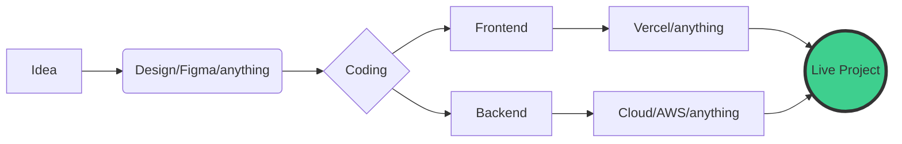

  

<h1 align="center">
  
</h1>

  
  
  

 

### 💫 About Me:

Hi! I'm **Algifahri Tri Ramadhan**, a student at **SMK Taruna Bhakti**. I believe that in the world of technology, we are all lifelong students. Although I am still at the beginning of my journey and have a lot more to learn, I am deeply committed to mastering the craft of web development one line of code at a time.

- 🚀 **Growth Mindset**: I see every bug as a lesson and every project as an opportunity to grow.
- 📚 **Continuous Learning**: Currently exploring the vast world of Fullstack Development.
- 🌱 **Humble Beginnings**: Proudly building my foundation and always open to feedback and mentorship.

---

### 🛤️ My Learning Path:

  
    
  <i>"The more I learn, the more I realize how much I don't know."</i>

---

### 🛠️ Development Workflow:

---

### 🌐 Socials:

---

### 📊 GitHub Stats:

  
  
   
  

 

---

  
   
  

